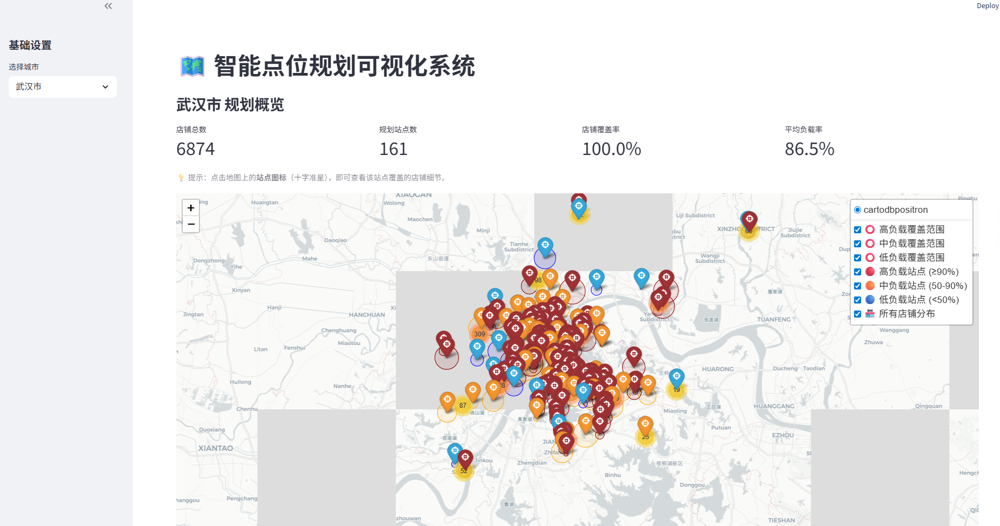
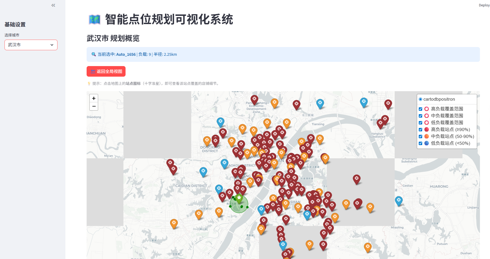

# Smart Site Planner

[](https://www.python.org/)
[](https://streamlit.io/)

**License:** No license is granted for reuse, modification, or redistribution.

English | [Simplified Chinese](README_ZH.md)

Smart Site Planner is a Python and Streamlit system for planning delivery-site coverage from point-of-interest (POI) coordinates. It groups stores by district, proposes sites with capacity and radius constraints, writes site assignments, and visualizes the result on an interactive map.

This repository reflects collaborative course/project work. Please preserve existing team and course attribution when contributing; do not present the project as the work of one person.

## Quick Start

```bash
git clone https://github.com/JojoZhu9/smart-site-planner.git
cd smart-site-planner
pip install -r requirements.txt
```

Create `data/data.txt` with the required columns below, then run:

```bash
python main.py
streamlit run src/visualizer.py
```

The planner writes `data/output_centers.csv` and `data/output_details.csv`. Start the dashboard only after those files have been generated.

## Data Contract

The default input path is `data/data.txt`, configured in `src/config.py`. The loader tries tab-separated input first and retries as comma-separated input if `tbsg_latitude` is not found. Keep POI and location data private; do not commit operational datasets.

| Column | Meaning | Required |
| --- | --- | --- |
| `tbsg_longitude` | Store longitude | Yes |
| `tbsg_latitude` | Store latitude | Yes |
| `second_district_name` | City or second-level district used to partition planning work | Yes |

Invalid longitude or latitude values are converted to missing values and dropped. `COL_SALES` and `COL_CITY_TIER` are empty in the shipped configuration, so sales and city-tier-specific behavior are not enabled by default.

## Configuration

Update [src/config.py](src/config.py) when adapting the planner to a different dataset. The shipped defaults are:

| Setting | Default | Purpose |
| --- | --- | --- |
| `DATA_PATH` | `./data/data.txt` | Input dataset |
| `MAX_CAPACITY` | `120` | Maximum stores per final site |
| `DEFAULT_RADIUS_LIMIT` | `3.0` km | Fallback coverage radius |
| `MERGE_DISTANCE_THRESHOLD` | `1.0` km | Candidate merge threshold |

The same file also defines the input column names and optional city-tier radius limits.

## How It Works

For each non-empty district, `main.py` runs a three-stage candidate workflow before final refinement:

1. Generate candidates with capacities of 50 and 120 stores.
2. Merge and prune those candidate sets using `MERGE_DISTANCE_THRESHOLD`.
3. Load merged candidates into the final capacity-120 solver.

The solver uses spatial neighbor queries, greedy clustering, minimum-enclosing-circle geometry, and post-processing to absorb compatible sites, merge nearby sites, merge small sites, and attempt to assign uncovered stores. Results are saved as a site table and a store-assignment table. `src/visualizer.py` reads both outputs, filters by district, and renders sites, coverage circles, and store points with Folium in Streamlit.

## Outputs

| File | Contents |
| --- | --- |
| `data/output_centers.csv` | Final site identifiers, district and tier, coordinates, radius, load, capacity rate, center sales, and source type |
| `data/output_details.csv` | Per-store planning fields with assigned center identifiers, coverage status, and distance-to-center details for the visualizer |
| `logs/solver_run.log` | Runtime log created by `main.py` |

These files are generated locally and ignored by Git.

## Screenshots

### Main Interface


### Site Coverage


## Validation and Limitations

Run the available syntax check with:

```bash
python -m compileall main.py src test_main.py
```

`test_main.py` is an experiment runner for comparing merge thresholds, not a pytest test module. The repository currently contains no collected pytest test cases, so `python -m pytest test_main.py -q` exits with zero tests collected. This is a repository limitation, not test coverage. The code also has no bundled sample dataset; run it only with an appropriately authorized dataset that follows the documented schema.

## Contributing and Security

Read [CONTRIBUTING.md](CONTRIBUTING.md) before opening a pull request. Report sensitive-data, credential, or dependency concerns through [SECURITY.md](SECURITY.md), not a public issue.

## Project Layout

```text
smart-site-planner/
├── images/                 # Tracked dashboard screenshots
├── src/
│   ├── config.py           # Paths, schema names, and planner parameters
│   ├── merger.py           # Candidate merge and pruning logic
│   ├── solver.py           # Coverage solver and post-processing
│   ├── utils.py            # Geographic and geometry helpers
│   └── visualizer.py       # Streamlit/Folium dashboard
├── main.py                 # Batch planning entry point
├── test_main.py            # Threshold experiment runner
└── requirements.txt        # Python dependencies
```
