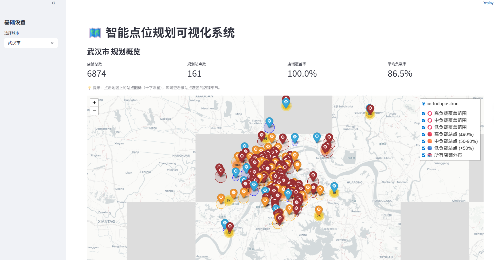

# 🗺️ 智能点位规划与可视化系统

[](https://www.python.org/)
[](https://streamlit.io/)

## 🌐 语言
- [English](README.md)
- [中文](README_ZH.md)

## 📖 项目简介
这是一个智能点位规划系统，基于POI数据自动生成最优的配送站点位置。系统确保100%覆盖率，同时最小化站点数量和重合度。

## ✨ 核心功能

### 🧠 智能算法
- **100%覆盖保证** - 每个店铺都被分配到站点
- **最小覆盖圆优化** - 数学优化确保紧凑覆盖
- **多阶段优化** - 吞噬、合并、清理操作

### 🗺️ 交互式可视化
- **零延迟交互** - 点击站点立即显示覆盖店铺
- **重合度检测** - 红色虚线显示重合区域
- **实时指标** - 覆盖率、负载率、重合率

## 🖼️ 界面截图

### 主界面

*城市选择和站点可视化*

### 站点覆盖

*点击站点查看覆盖的店铺（绿色点）*


## 📂 项目结构
```
SmartSite/                  
├── data/                   
│   ├── data_test.csv       # 输入数据
│   ├── output_centers.csv  # 输出结果
│   └── output_details.csv  # 输出结果
├── images/
│   ├── main_interface.png  # 主界面屏幕截图
│   └── site_coverage.png   # 站点覆盖屏幕截图
├── src/                    
│   ├── __init__.py         # 标识
│   ├── config.py           # ⚙️ 配置文件
│   ├── utils.py            # 🛠️ 工具函数 
│   ├── solver.py           # 🧠 核心算法 
│   └── visualizer.py       # 📊 可视化逻辑
├── main.py                 # 🚀 算法启动入口
├── .gitignore              # Git 忽略配置
└── requirements.txt        # 依赖库列表
```

## 🚀 快速开始

### 1. 安装依赖
```bash
git clone https://github.com/yourusername/site-planning.git
cd site-planning
pip install -r requirements.txt
```

### 2. 准备数据
将 `data_test.csv` 文件放在项目根目录。

### 3. 运行算法
```bash
python main.py
```
生成结果文件：
- `output_centers.csv` - 站点位置
- `output_details.csv` - 店铺分配

### 4. 启动看板
```bash
streamlit run src\visualizer.py
```
浏览器打开 `http://localhost:8501`

## ⚙️ 配置
修改 `config.py` 匹配你的数据：
```python
MAX_CAPACITY = 100           # 单个站点最大店铺数
DEFAULT_RADIUS_LIMIT = 3.0   # 默认半径限制(km)
COL_LNG = 'longitude'        # 经度列名
COL_LAT = 'latitude'         # 纬度列名
COL_CITY = 'poi_second_district_name'  # 城市列名
```

## 📊 算法流程
1. **初始生成** - 从高密度区域创建站点
2. **优化迭代** - 合并和清理站点（5轮）
3. **覆盖检查** - 确保100%覆盖
4. **最终计算** - 计算最优位置
